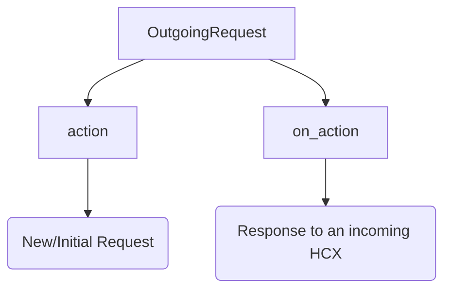

# Python Integrator SDK

What is the HCX SDK?

HCX SDK is a bridge/switch between the provider and the payor. It validates requests from the provider to the payor & allows the payor to respond back to the provider.

### Summary

1. Initialzation of the SDK: Initilaize the `HCXIntegrator` class
2. Outgoing Requests: There are two types of outgoing requests

3. Only the header changes incase of on_action callback, The input request JWE should be used as `actionJwe`.
4. Next step is to validate FHIR Request -> Create Header -> Encrypt Payload (these methods are explained below in detail).
5. Once the payload is encrypted, It is sent to the Payor via HCX Instance (payor endpoint URL can be found at `registry->endpoint_url`)
6. Incoming request

## Initiating the SDK
Python class: `HCXIntegrator()`

Member Variables:
```py
config: dict {
    'participantCode': "",  # unique id generated by HCX
    'authBasePath': “”,  # will give you token (used alongside username and password to generate token)
    'protocolBasePath': “”,  # Base Path of the HCX Instance to access Protocol APIs.
    'username': “”,  # Username of the integrator
    'password': “”,  # password of the integrator
    'encryptionPrivateKey': “”,  # Private key of the sender/recipient
    'igUrl': “”  
}
```

## Outgoing Methods
As a sender, the steps are following:

### Validating FHIR request

```py
def validatePayload(fhirPayload : str, operation: Operation, error: dict):
    """
    fhirPayload: FHIR Payload in json format
    """
    returns bool
```
Handles errors as per: [hcx-protocol | error-descriptions](https://docs.hcxprotocol.io/hcx-technical-specifications/open-protocol/key-components-building-blocks/error-descriptions) while excluding the following error messages:
`ERR_INVALID_ENCRYPTION`,
`ERR_WRONG_DOMAIN_PAYLOAD`,
`ERR_INVALID_DOMAIN_PAYLOAD`,
`ERR_SERVICE_UNAVAILABLE`,
`ERR_DOMAIN_PROCESSING`.

### Create a Header for the payload

Headers vary based upon the type of outgoing request call.
* For `action` headers we only need the `recipientCode`.
* For `on_action` type, the jwe payload recieved from incoming request is provided as `actionJwe`. 

```py
def create_headers(senderCode: str, recipientCode: str, apiCallId: str, correlationId: str, actionJwe: str, onActionStatus: str):
    """
    Parameters
    ----------
    senderCode: str (given)
        Unique HCX sender code from registries
    recipientCode: str
        Unique HCX recipient code from registries
    apiCallID: str (optional)
        Unique id for each request
    correlationId: str (optional)
        Unique id for each cycle, this is generated if empty & later passed to allother callbacks as a custom identifier.
    actionJwe: str (optional)
        The jwe payload recieved from incoming request. Required for `on_action` headers.
    onActionStatus: str (optional)
        Hcx protocol header status, (x-hcx_status in registry).
    
    Returns
    -------
    header: dict
        On success, The HCX protocol header to create JWE Payload
    error: dict
        On failure, error in creation of header.
    """
    return Json
```
`create_headers` only the recipient code needs to be provided. Rest parameters are set on the creation of the HCXIntegrator instance.


### Encrypt Payload
```py
def encrypt_payload(headers: dict, fhirpayload: str):
    """
    Parameters
    ----------
    headers: dict
        HCX headers from createHeaders method.
    fhirPayload: str
        FHIR object to be encrypted.
    
    Returns
    -------
    enc: str
        Encrypted JWE payload.
    """
    # find public certificate from the searchRegistry method
    # encrypt payload using public certificate of the recipient
    # (public certificate of the recipient is used so that the recipient can decrypt it using his private key)
    # Returns a JWE (json) object with encrypted fields
    return JWE
```

### Search Registry
```py
def searchRegistry(searchField: str, searchValue: str):
    # Creates HCX token
    # Searches in {basePath} + "/participant/search"
    # Create search payload, example: 
    # {"filters": {
    #   searchField: {
    #       "eq": searchValue
    #   }
    # }}
    # Returns Json object with registry fields in it.
    return Json
```

### Initialize HCX Call

```py
def initializeHCXCall(jwePayload: str, operation: Operation):
    return response
```

This function does the following:
* Generate the token using the config (generateHCXToken function) and adds to the call.
* Call the HCX  API
* Recieved response will be added to response as `{“responseObj”: {success/error response}}`

### Wrapper classes
1. For action API request: 
```py
def generate(fhirPayload, operation, recipientCode):
    return output
```

2. For `on_action` API request:

```py
def generate(fhirPayload, operation, recipientCode, apiCallId,
             correlationId, actionJwe, onActionStatus, domainHeaders):
    return output
```
* Output is of type `dict`. It can be of wither of the following cases:
    1. On Success: success output- 
    ```py
    {
        "payload":{}, # jwe payload
        "responseObj": {
         "timestamp": , # unix timestamp
         "correlation_id": "", # fetched from incoming request
         "api_call_id": "" # fetched from incoming request
        }
    }
    ```
    2. error output-
    ```py
    {
        "payload":{}, # jwe payload
        "responseObj":{
         "timestamp": , # unix timestamp
         "error": {
           "code" : "", # error code
           "message": "", # error message
           "trace":"" # error trace (what is error trace)
         }
       }
    }
    ```


## Incoming Methods

Processes incoming request, decrypts the payload & extracts the FHIR object.

### Protocol Validations
Only incoming header is validated, and exceptions are thrown.
```py
def validateRequest(jwePayload: str, operations: Operation, error: dict):
    returns bool
```
Validation happens against the Recipient error scenarios as per: https://docs.hcxprotocol.io/hcx-technical-specifications/open-protocol/key-components-building-blocks/error-descriptions

Excluded error scenarios
`ERR_INVALID_ENCRYPTION`,`ERR_WRONG_DOMAIN_PAYLOAD`,`ERR_INVALID_DOMAIN_PAYLOAD`,`ERR_SERVICE_UNAVAILABLE`,`ERR_DOMAIN_PROCESSING`.

### Decrypt Payload

```py
def decryptPayload(encryptedString: str):
    # Finds the private key, decrypts the encrypted JWE.
    #
    # If successful - returns a dictionary that contains header & FHIR object
    # Example: 
    # {
	#   “headers”: {},   # protocol headers
	#   “fhirPayload”: {}  # FHIR object
    # }
    # 
    # If Failed - returns a dictionary containing error codes & messages
    # Example:
    # {
    # 	“error_code”: “error_mesage”
    # }
    return dict
```

### Domain object Validation
``` py
def validatePayload(fhirPayload: str, operation: Operation, error: dict)
```
**NOTE**
* Same function as that of Outgoing requests
* fhirPayload parameter should be the str received from the decryptPayload function.
Returns:
```py
True: # If the payload passes all the checks and an empty error output for successful operation.
False: # If the payload fails validations and error output as per the recipient error scenarios.
```
Following return scenarios to be returned:
`ERR_WRONG_DOMAIN_PAYLOAD`,
`ERR_INVALID_DOMAIN_PAYLOAD` - Along with the FHIR validation results.


### Acknowledgment
```py
def sendResponse(error: dict, output: dict):
    # If the error is empty, success response is to be returned.
    # Example:
    # {
    #   "headers":{}, - protocol headers
    #   "fhirPayload":{}, - fhir object
    #   "responseObj": {
    #   "timestamp": , - unix timestamp
    #   "correlation_id": "", - fetched from incoming request
    #   "api_call_id": "" - fetched from incoming request
    # }

    # If there are any errors, an error response object is returned.
    # Example:
    # {   
    #   "headers":{}, - protocol headers
    #   "fhirPayload":{}, - fhir object
    #   "responseObj":{
    #   "timestamp": , - unix timestamp
    #   "error": {
    #        "code" : "", - error code
    #        "message": "", - error message
    #        "trace":"" - error trace
    #     }
    #   }

    return dict
}
```
### The process

```py
def process(jwePayload: str, operation: Operation):
    return dict
```

* Returns output (dict) that contains `fhirPayload`, `headers`, `responseObj (success/error response to be sent to hcx gateway)`
* Functions calls happen in the following order:
    1. validateRequest
    2. decryptPayload
    3. validatePayload
    4. sendResponse


## Operations

Operations contains the redirect URL for a specific API calls.
```py
class HcxOperations():
        COVERAGE_ELIGIBILITY_CHECK ="/coverageeligibility/check"
        COVERAGE_ELIGIBILITY_ON_CHECK = "/coverageeligibility/on_check"
        PRE_AUTH_SUBMIT = "/preauth/submit"
        PRE_AUTH_ON_SUBMIT = "/preauth/on_submit"
        CLAIM_SUBMIT = "/claim/submit"
        CLAIM_ON_SUBMIT = "/claim/on_submit"
        PAYMENT_NOTICE_REQUEST = "/paymentnotice/request"
        PAYMENT_NOTICE_ON_REQUEST = "/paymentnotice/on_request"
        HCX_STATUS = "/hcx/status"
        HCX_ON_STATUS = "/hcx/on_status"
        COMMUNICATION_REQUEST = "/communication/request"
        COMMUNICATION_ON_REQUEST = "/communication/on_request"
        PREDETERMINATION_SUBMIT = "/predetermination/submit"
        PREDETERMINATION_ON_SUBMIT = "/predetermination/on_submit"
```


